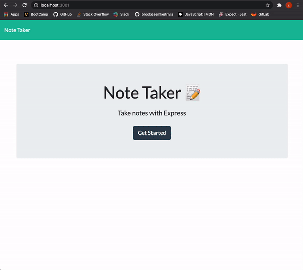

# Note Taker Express

## Summary
This app is design for a simple work spave to keep track of notes. Created from Express.js.

## Prerequisites
* [NodeJS](https://nodejs.org/)

## Installation

Clone the repository.

```
git clone git@github.com:zpuckett/express-note-taker.git
```

Navigate to the express-note-taker folder using the command prompt.
Use npm install and node server.js to view on localhost.

## Walkthrough




## Made with...

* Node.js
* Express
* JavaScript

## Contrbution

* Vanderbilt Coding Bootcamp

Made with :heart: by Zach Puckett.


